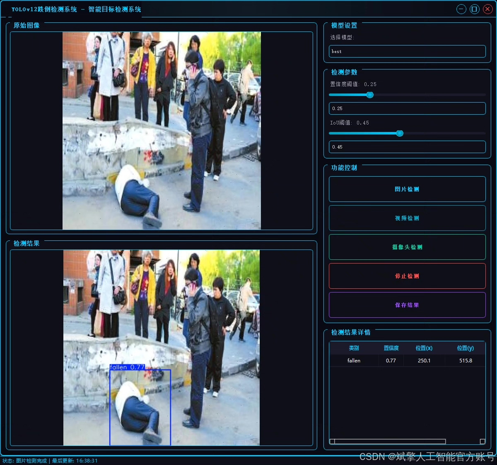
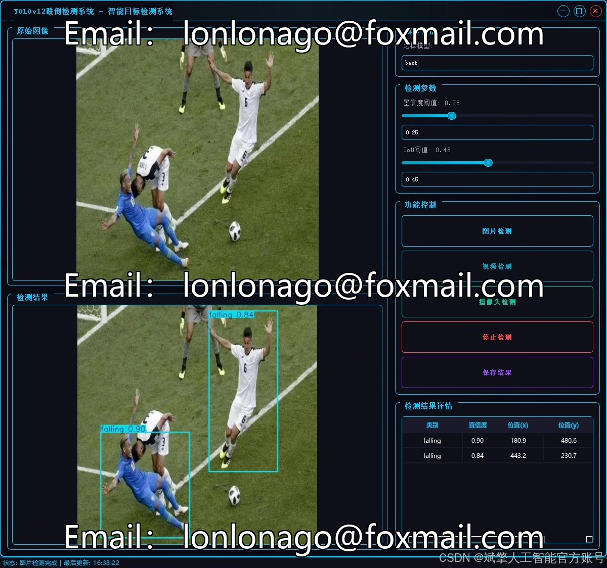
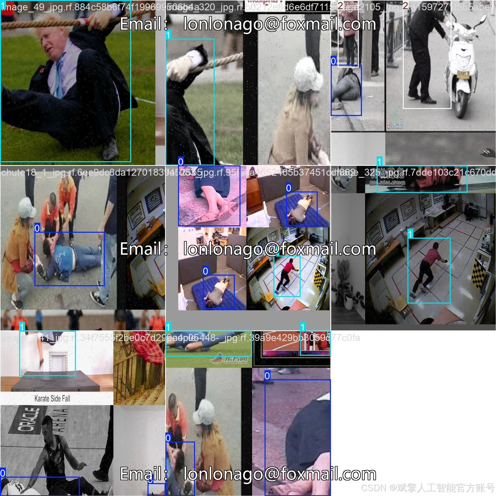
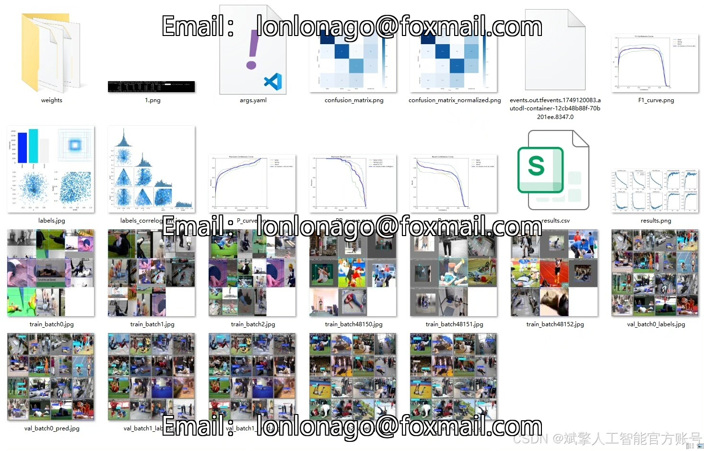
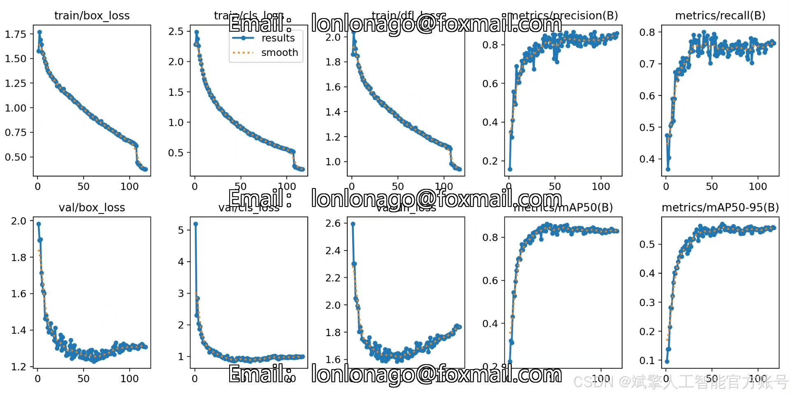
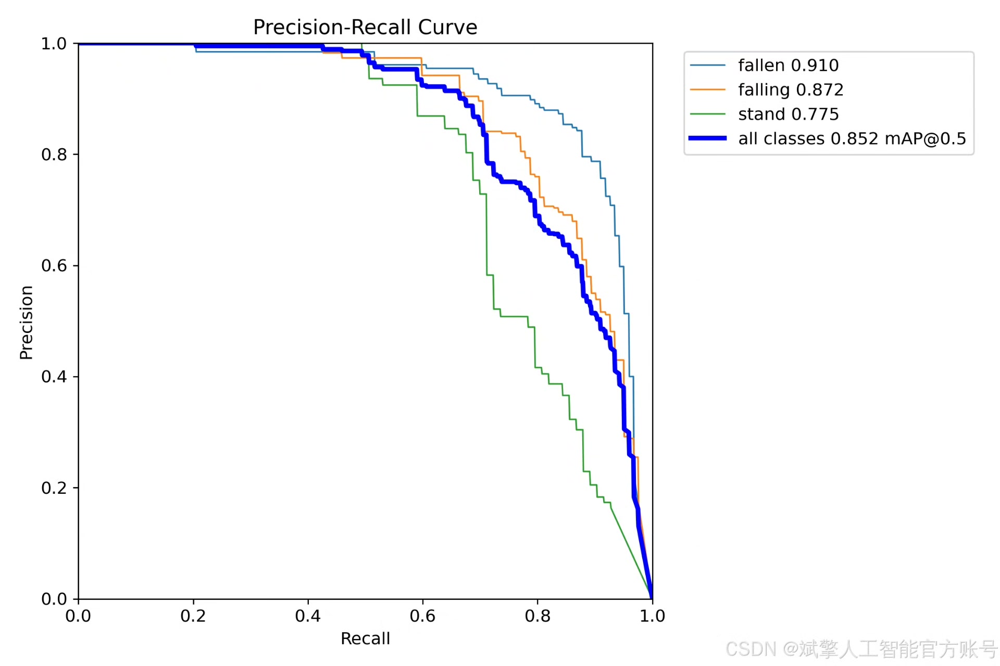
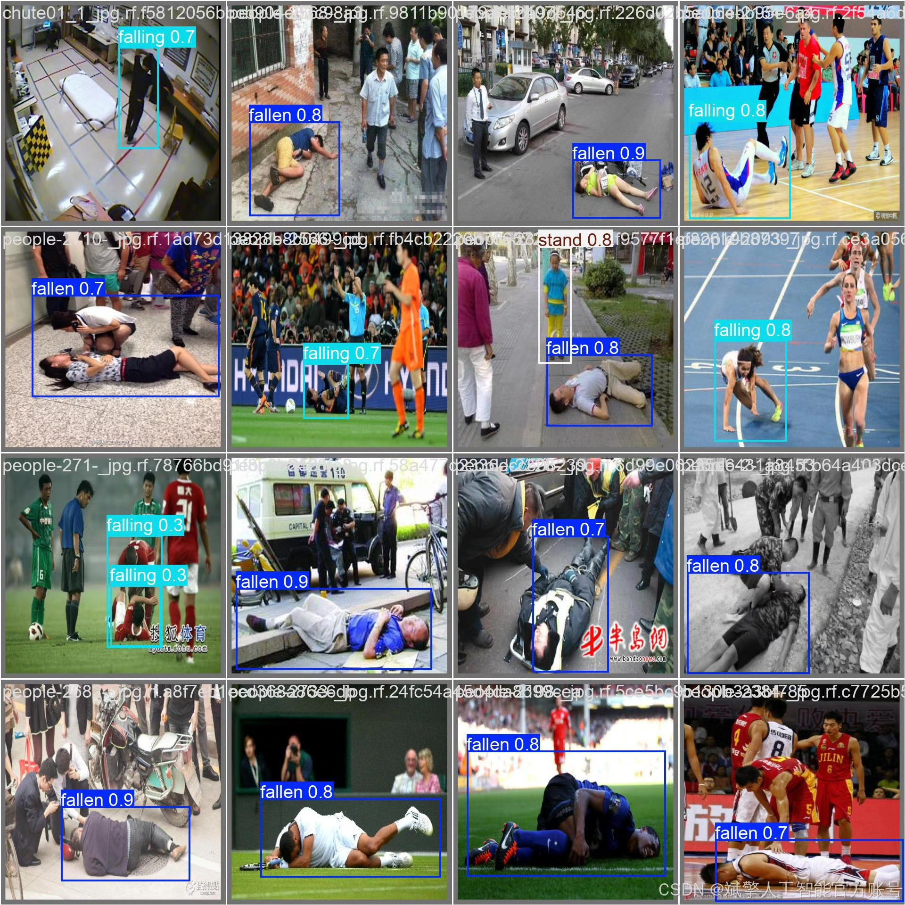

# YOLOv12 Fall Detection System

## Body

The YOLOv12 Fall Detection System, based on deep learning and YOLOv12, aims to accurately identify falls through real-time video surveillance, enhancing public safety and elderly health monitoring capabilities. The system utilizes the YOLOv12 object detection algorithm, optimizing for three behaviors (falling, fallen, standing) and employs a custom YOLO format dataset (comprising 3594 training images and 294 validation images). Combined with a PyQt-developed UI interface, the system supports user login and registration. Experimental results indicate that the system has high detection accuracy and real-time performance in complex scenarios, providing effective solutions for intelligent security and medical monitoring.
✅ User Login & Registration: Supports password verification and security validation.
✅ Three Detection Modes: Based on the YOLOv12 model, supporting image, video, and real-time camera detection, for precise target identification.
✅ Dual-Screen Comparison: Display original images and detection results side by side.
✅ Data Visualization: Real-time table displays the category, confidence, and coordinates of detected targets.
✅ Intelligent Parameter Tuning: Offers a confidence slide bar for dynamic optimization of detection precision, adapting to different scene requirements.
✅ Sci-Fi Interactive Interface: Dark theme paired with dynamic light effects, reducing visual fatigue and enhancing operational experience.

## Images

## Payment

Here is a pay link on Stripe ( https://buy.stripe.com/3cs8yP7sY87d0vu9AB ). Please contact me lonlonago@foxmail.com after funding $89, and I will send you a complete data files , thank you!

